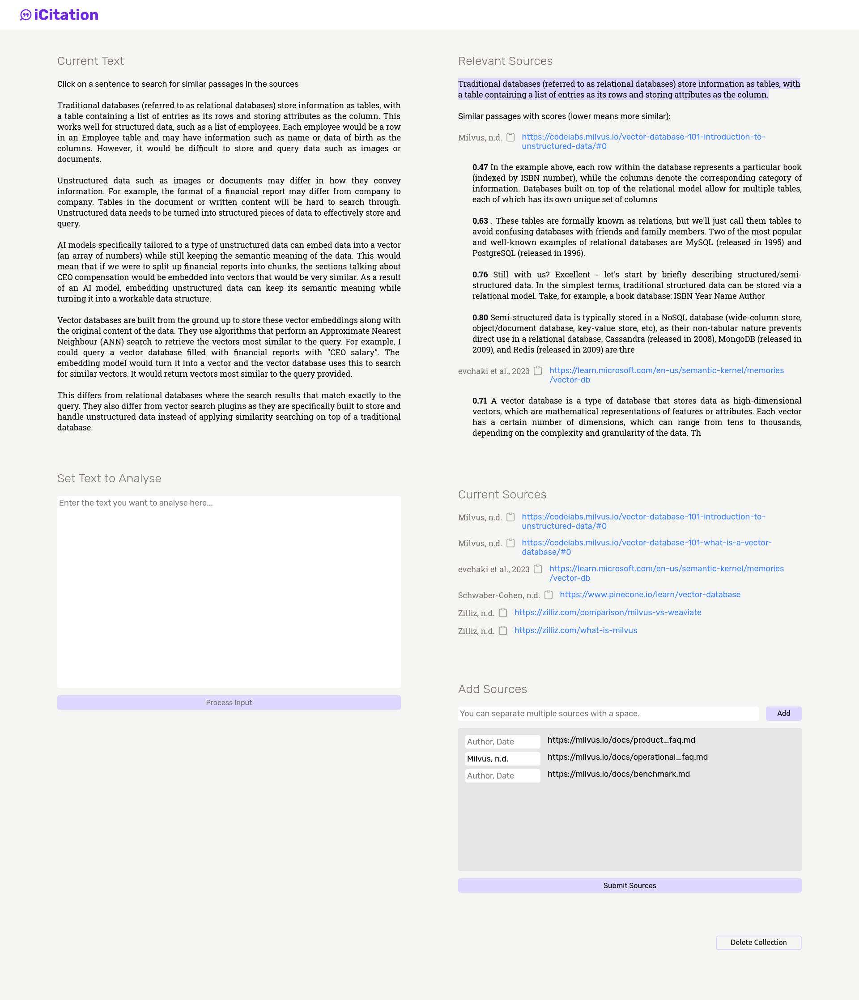

# iCitation

An application that looks at input text to search for similar passages within given sources

## Installation

Install and start Milvus

https://milvus.io/docs/install_standalone-docker.md

Install requirements

`pip install -r requirements.txt`

Start app

`flask run`